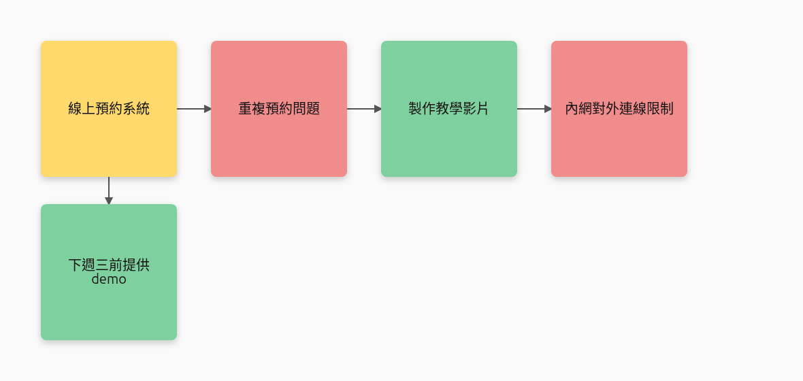
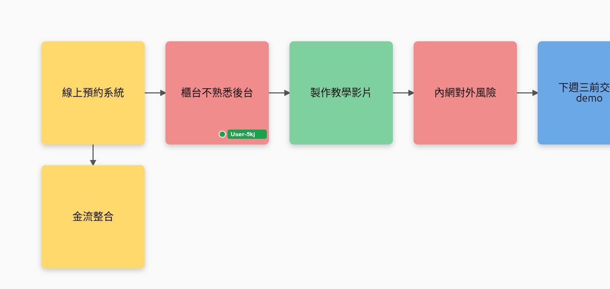

# foss-whiteboard-spike

`tldraw-agent-spike` 的**零授權成本雙胞胎**,現在已長成一個小型可玩的會議白板:**語音 → STT → agent → 共享 live 白板**,加上人類可在 Konva 畫布上拖拉/編輯/連線。全 MIT、能賣。

```
會議語音 ─mori-ear─▶ 逐字稿 ─Groq/Qwen3 agent─▶ 便利貼+連線 ─yjs─▶ 多人 live 白板
人類也能在同一張板上 拖拉 / 雙擊改字 / 連線 / 刪除(即時同步給所有人)
```

## 結論:三步都通(真元件、真瀏覽器驗證)



上圖整張板是**點一下「丟給 agent」**、把一段會議逐字稿丟給真 Groq(`openai/gpt-oss-120b`)後自動長出來的 —— 6 張便利貼按性質上色(主題=黃、決議=藍、待辦=綠、風險=紅),其中「線上預約系統」被拖到右下、兩條連線箭頭跟著它走(edge-clamp 貼邊)。

| 步驟 | 做了什麼 | 驗證 |
|---|---|---|
| **1. agent loop** | 逐字稿 → Groq(`gpt-oss-120b`)→ 結構化 JSON(便利貼+連線),失敗 fallback 本機 Ollama `qwen3:8b` | 真 Groq 從會議稿抽 6 張正確 zh-TW 便利貼;qwen3:8b 也實測可回 JSON |
| **2. mori-ear STT** | 錄音 → `/api/voice` → `mori-ear --input`(宇宙單一 STT)→ 逐字稿 → agent → 板 | 真 wav 經 mori-ear 轉出「嗯,我在聽。」;voice endpoint 全鏈路跑通 |
| **3. Konva 互動** | 拖拉移動、雙擊空白新增、雙擊改字、連線模式、選取刪除、清空、**空白拖曳平移 + 滾輪縮放** | 拖拉(patchShape)即時同步、連線箭頭渲染、agent 結果即時上板 — 像素級驗證 |

agent/錄音是 **累積 + 智慧合併**:每次把白板現有便利貼餵給 agent,它只加「這段新講到的」重點(不重複),連線可接到既有便利貼;連兩段不同主題會累積成一張會議板而非重畫。

底層仍是前一版證好的:server 端寫共享 Y.Doc → 所有瀏覽器 <15ms 即時看到。全 MIT,無 tldraw 那顆 production license。

### v0.3:Mori 出現在板上 + 持久化



- **Mori 是看得見的參與者**:agent 寫便利貼時用 yjs awareness 廣播 Mori 的游標,便利貼**一張一張串流冒出**、游標跟著移動,畫完離開。所有連線的人即時看到「Mori 正在畫」。(上圖綠色 `User-5kj` 是另一個分頁的真人游標 —— 人類彼此的游標也即時可見。)
- **持久化**:每個房間的 Y.Doc 快照存到 `.data/<room>.bin`(debounce 寫),server 重啟自動還原,不再一重啟就清空。
- 驗證:便利貼進度 `[0,1,2,3,4,5]` 逐張出現;Mori 游標串流期間出現、結束消失;兩個分頁互看游標;`persisttest` 房重啟後從磁碟還原。

## 架構

| 部件 | 檔案 | 說明 |
|---|---|---|
| 自架 sync server | `server/sync-server.ts` | 自寫 classic-yjs 協定(`y-protocols`+`lib0`);bot/agent/voice endpoints |
| LLM cascade | `server/llm.ts` | Groq(`openai/gpt-oss-120b`)→ Ollama(`qwen3:8b`)fallback;key/model 讀**共享 `~/.mori/config.json`**(`providers.groq` / `providers.ollama`),跟 mori-meeting-recorder 同一份 |
| agent | `server/agent.ts` | 逐字稿 → board plan(stickies+connectors);prompt 約束「只用稿內事實、最多 6 張、kind→顏色」;JSON 寬鬆解析(剝 `<think>`/圍欄) |
| STT | `server/stt.ts` | 委派 `mori-ear --input <file>`(吃 wav/mp3/webm,走宇宙共享 whisper-server) |
| client | `client/src/App.tsx` | `yjs` + `WebsocketProvider` 同步 → `react-konva` 渲染;拖拉/建立/編輯/連線/刪除;agent textarea + 錄音鈕 |

### HTTP endpoints(都在 :1234)

```
POST /api/bot/:room/sticky    { text?, color? }            # server 端畫一張
POST /api/agent/:room         { transcript }               # 逐字稿 → agent → 板
POST /api/voice/:room?ext=webm  <raw audio bytes>          # 語音 → ear → agent → 板
GET  /api/health
```

## 跑起來

需要:Node 22、`~/.mori/config.json` 內有 `providers.groq.api_key`(跟宇宙其他 app 共用);語音那條另需 `mori-ear` 在 PATH/`~/.cargo/bin`;fallback 那條需 `ollama serve` + 已 pull `qwen3:8b`。

```bash
npm install
npm run dev          # sync server(:1234)+ Vite client(:5174)
```

開 `http://localhost:5174/?room=spike`:

- **雙擊空白** 新增便利貼、**雙擊便利貼** 改字、**拖拉** 移動、**連線模式** 點兩張連線、選取後 **Delete** 刪除。
- 左下面板貼一段會議逐字稿按 **丟給 agent**,或按 **● 錄音** 講話(用 mic)→ 自動轉錄 + 上板。
- 開兩個分頁進同房,所有動作即時同步。

CLI 也可:
```bash
npm run bot -- "外部 agent 寫的" spike blue        # 外部 yjs peer 寫一張
curl -X POST localhost:1234/api/agent/spike -H 'Content-Type: application/json' \
  -d '{"transcript":"今天開會討論…"}'               # 逐字稿 → 板
curl -X POST 'localhost:1234/api/voice/spike?ext=wav' \
  -H 'Content-Type: audio/wav' --data-binary @clip.wav  # 語音 → 板
```

## 驗證過程中踩到的雷(寫給下一棒)

1. **`@y/websocket-server`(yjs v3 官方推薦 server)不能用 classic yjs client 寫** —— 內部依賴 fork `@y/y`,client→server 寫會噴 `store.getClock is not a function`(對「產品要能 client 端寫」致命)。解法:自寫 classic-yjs server(本 repo `sync-server.ts`)。
2. **React StrictMode + effect cleanup `provider.destroy()` 會殺連線** —— dev 下 mount→cleanup→mount,剛連上就被拆。本 spike 拿掉 StrictMode。
3. **note 文字渲染**:本版用 Konva `<Text>` 沒問題;但若改回 tldraw,note 的 `fontSizeAdjustment` 不能填 0(=字體×0 隱形)。
4. **automation chrome 截圖會全黑**(混合 GPU),要改讀 canvas 像素 / `canvas.toDataURL()` 導出 backing store(本 repo proof 圖都這樣產)。
5. **agent JSON**:gpt-oss / qwen3 都可能夾 `<think>` 或 markdown 圍欄,解析要先剝再取外層 `{...}`;qwen3 記得 `think:false`。
6. **mori-ear**:batch 模式 `--input` 不卡 single-instance lock(daemon 在跑也能用);HTTP `/inference` 只吃 WAV,CLI 才吃 webm/mp3,所以 voice endpoint 走 CLI 最通用。

## 下一步(此 spike 之外)

- connectors 方向語意上色 / 加標籤。
- room 生命週期 + 鑑權(目前任何人可進任何房)。
- 把它接成 Mori 的白板「身體部件」,語音來源走 mori-ear 的即時串流而非一次錄一段。
- 智慧合併再進化:讓 agent 也能「改寫/合併」既有便利貼,而不只是新增。
- 持久化升級:目前是整份快照覆寫,大板可改增量 append log。
