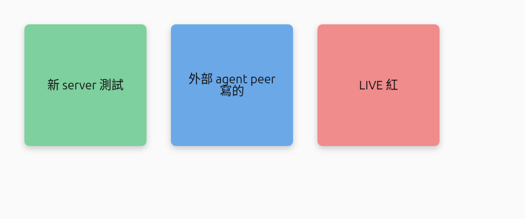

# foss-whiteboard-spike

`tldraw-agent-spike` 的**零授權成本雙胞胎**。證明同一條鏈路 —— server 端 bot 把東西畫進自架的多人房、所有瀏覽器即時看到 —— 在**全 MIT、能賣**的 stack 上一樣跑得通。

```
server 端程式 ──▶ 共享 Y.Doc(Y.Map 'shapes')──▶ 每個連線的瀏覽器即時看到
```

畫布層從 tldraw(source-available,production 要 license)換成 **Konva(MIT)**,CRDT/同步換成 **yjs + 自寫的 classic-yjs sync server(MIT)**。沒有任何一個依賴需要付費或授權金。

## 結論:通了,而且能賣



上圖三張便利貼**全是程式寫進共享房的**,瀏覽器沒重整即時浮現:

- 綠「新 server 測試」= server 端 HTTP bot 寫的
- 藍「外部 agent peer 寫的」= **另一個 process** 以 yjs peer 身分連進房寫的(最貼近「agent 當參與者」)
- 紅「LIVE 紅」= 連線中即時 push

已驗證(真瀏覽器 + 像素級):server 對空房寫入 → 種出 shapes;瀏覽器經自架 WS sync 連上(`synced`)收到既有 shapes;live push <15ms 到達不重整;**client→server 寫入也成立**(peer-bot);Konva 像素底色 exact(綠 `#7ed09e` / 藍 `#6ba8e8` / 紅 `#f08c8c`)。

## 全部是 permissive 授權(可閉源、可賣)

`yjs` · `y-protocols` · `lib0` · `ws` · `konva` · `react-konva` · `react` · `express` —— 全 MIT。**沒有 tldraw 那顆 production license 雷。**

## 架構

| 部件 | 檔案 | 說明 |
|---|---|---|
| 自架 sync server | `server/sync-server.ts` | Node + `ws` + `y-protocols`,**自寫 classic-yjs 協定**(~70 行),一房一個 Y.Doc;含 awareness |
| server 端 bot | `server/sync-server.ts` 的 `drawSticky()` | `doc.getMap('shapes').set(id, {...})`,doc.on('update') 自動廣播 |
| bot HTTP endpoint | `POST /api/bot/:room/sticky` | body `{ text?, color? }` |
| 外部 peer bot | `server/bot.ts` | 用 `WebsocketProvider` + `ws` polyfill,當獨立 process 連進房寫 |
| client | `client/src/App.tsx` | `yjs` + `WebsocketProvider` 同步 → `react-konva` 渲染便利貼 |

## 跑起來

```bash
npm install
npm run dev          # sync server(:1234)+ Vite client(:5174)
```

開 `http://localhost:5174/?room=spike`。讓 bot 畫:

```bash
# A. 外部 peer bot(獨立 process 當 yjs peer 加入)
npm run bot -- "外部 agent 寫的" spike blue

# B. server 端 HTTP bot
curl -X POST http://localhost:1234/api/bot/spike/sticky \
  -H 'Content-Type: application/json' -d '{"text":"hi","color":"green"}'

# C. 頁面上的「Bot draws a sticky」按鈕
```

開兩個分頁進同房即見即時同步。

## 驗證過程中踩到的雷(寫給下一棒,這些是這條路的真陷阱)

1. **`@y/websocket-server`(yjs v3 官方推薦的 server)不能用 classic yjs client 寫**。它內部依賴 yjs 的 fork `@y/y`,跟 client 的 classic `yjs@13` 在「整合 update」不相容 —— server→client 讀沒事,但 **client→server 寫會噴 `store.getClock is not a function`**。我們的瀏覽器是唯讀渲染,所以一開始沒踩到;peer-bot 一寫就爆。**對「能賣」是致命的(產品一定要能 client 端寫)。** 解法:自己寫 classic-yjs server(`y-protocols/sync` + `lib0`,就是本 repo 的 `sync-server.ts`),版本與 client 一致,而且不依賴 fork、完全自有可審。
2. **React StrictMode + 在 effect cleanup 呼叫 `provider.destroy()` 會殺掉連線**。dev 下 StrictMode 跑 mount→cleanup→mount,剛連上就被 destroy,之後 status/observe 不再更新(畫面卡 `connecting`、shapes 0,但底層 yjs 其實同步了)。解法:本 spike 拿掉 StrictMode;正式版要把 provider 生命週期管在 effect 外或別在每次 cleanup destroy。
3. **automation chrome 的 `take_screenshot` 可能整片黑**(混合 GPU/合成問題),但 canvas 其實有畫。驗證要靠**讀 canvas 像素**(`getImageData` 數非透明/彩色像素、抽樣底色)或 `canvas.toDataURL()` 直接導出 backing store(本 repo 的 proof 圖就是這樣產的)。
4. yjs v3 把 server 拆出去了,`y-websocket` 套件只剩 client(`WebsocketProvider`);Node 端當 client 要 `{ WebSocketPolyfill: ws }`。

## 跟 tldraw spike 的取捨

| | tldraw-agent-spike | 本 repo(FOSS) |
|---|---|---|
| 畫布 | tldraw(手感最好、自帶整套白板 UI) | Konva(只有渲染,白板互動要自己做) |
| 授權 | source-available,**production 要 license** | 全 MIT,**可賣** |
| agent↔畫布 | 官方 `@tldraw/ai` / agent kit 現成 | 自己定義 shape model + 寫入 |
| 結論 | 自用/驗證最快 | **要賣就走這條** |

## 下一步(此 spike 之外)

1. bot 換真 agent loop(沿用 mori 既有 Groq→Qwen3 cascade),吃會議轉錄產便利貼/連線/分組。
2. 接 mori-ear(STT)當語音輸入。
3. 讓使用者也能在 Konva 畫布上拖拉/編輯(目前唯讀渲染),並給 agent 自己的 awareness cursor/presence。
4. 持久化(目前 in-memory,server 重啟即清空)+ room 生命週期。
5. 白板互動(選取/縮放/連線工具)—— Konva 要自己長,這是相對 tldraw 最大的工作量差。
